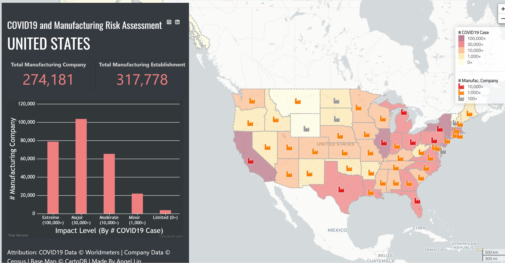
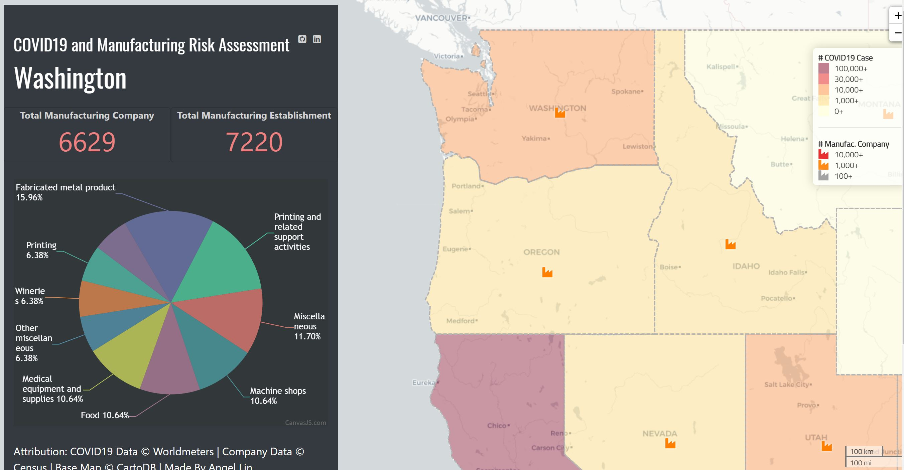
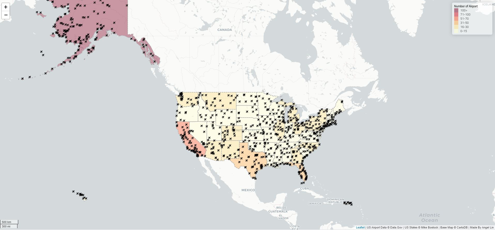
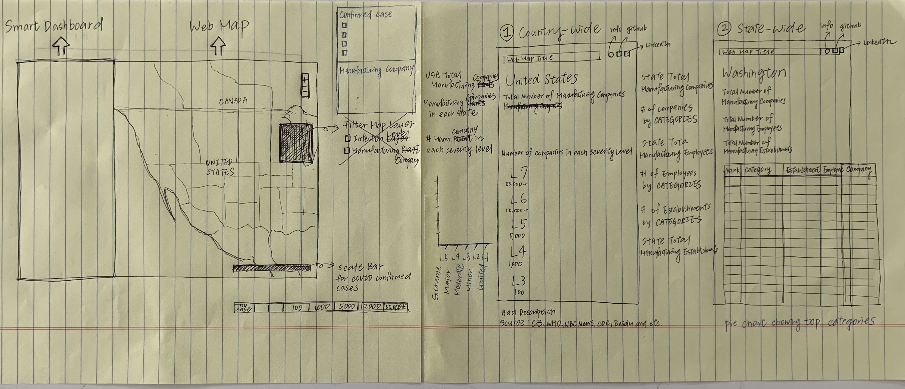

# COVID19 U.S. Manufacturing Company Dashboard
**Author:** Angel Lin  **Date:** 2020/06/05
<br>This is a web map with a smart dashboard that showcases the impact of COVID19 on the manufacturing industry in each state.




## Background Information

### Abstract
A supply chain is a network of organizations, resources, people, and information that are involved in the process of procurement of raw materials, production of goods, shipping between warehouses and retailers, and the distribution of finished goods to end customers. Over time, the traditional supply chain practices are being challenged, pressuring leaders to come up with innovative solutions to overcome the barriers in an increasingly complex environment. Consumer behavior and technology advancement have shaped the landscape of supply chain in an unprecedented way—customers expect companies to respond faster as well as shortening delivery time; rich, informative data flows into organizations in an accelerated rate; machine learning takes over the traditional labor intensive work. In addition, the global supply chain has been highly impacted over the course of COVID-19. With [more than 200 of the Fortune Global 500 firms having a presence in Wuhan](https://www2.deloitte.com/za/en/pages/risk/articles/covid-19-managing-supply-chain-risk-and-disruption.html), the original outbreak of coronavirus, companies need to react quickly to the disruption and focus more on building resilience, contingency plans, and risk assessment into supply chains. With all the reasons above, the industry is experiencing a transformation of physical supply chain to a digital supply network. Location intelligence, mapping and visualization tool, and real-time monitoring have become central to the digital transformation.

### GIS and Supply Chain
Geographic Information System (GIS) is a ground-breaking technology that provides tools and technologies to build a more resilient global supply chain. Since supply chain is a geographically intensive business, GIS can be very useful when it comes to mapping locations of manufacturing plants, warehouses, distribution centers, suppliers, and customers. It can also be used to analyze routes and understand operating environment around the corporate. Most importantly, GIS offers a valuable supply chain risk management tool during uncertain times. In a pandemic environment for example, risks become dynamic. Companies need visibility to the entire value chain to understand what and where the impact is, and transparency to their suppliers to manage and mitigate risks. Presenting supply chain performance data in the form of a spreadsheet ignores the real-world influence of geography on transportation. Therefore, supply chain professionals need GIS to manage massive amount of location-based or spatial data to make better decisions and strategies.

### Web Mapping
A web map is an interactive online map that displays geographic information and content organized as layers. The goal is to tell stories or answer questions through visualizing geographic spatial data. For example, this web map I created shows all the airports in the United States. This map can answer questions such as where all the airports are located at and which states have the highest total number of airports.



In general, a map contains a reference basemap, a set of data layers (often include interactive pop-up windows with information about the data), map extent, and navigation tools to pan and zoom. Since a web map is hosted online, the content can be shared across different applications, users, and devices.

### Smart Dashboard
Many of the web map interfaces also come along with a smart dashboard. A dashboard is a graphical user interface that visually displays important information from multiple data sources into one place. On a web map, a smart dashboard plays the role of organizing and highlighting key information from the map. The data shown on the smart dashboard usually changes accordingly to the user’s interaction with the web map. An example of the usage of smart dashboard is the [Johns Hopkins University COVID-19 Dashboard](https://coronavirus.jhu.edu/us-map). The map provides three aspects for viewers: World Map, U.S. Map, and Critical Trends, and includes multiple smart dashboards to reflect the overall COVID-19 statistic in real time.

Both web mapping and smart dashboard are crucial analytics techniques that will help supply chains to enhance risk management strategies, increase visibility and transparency throughout the process, and stimulate responsiveness. They help organize complicated information and provide key insights to enable front-line decision making.

## Project Introduction

### Motivation
COVID19 has caused the biggest factory closing since World War II. In the United States, manufacturing industry accounts for 11.39% of the total output in the economy, employing more than 12 million U.S. workers. Due to the COVID19 outbreak, the supply chain industry is now experiencing the biggest disruption of all time. To help supply chain leaders get an insight of how the manufacturing industry is impacted, I created a map that incorporates both COVID19 and manufacturing data of each state. The map is a risk assessment for supply chain leaders to evaluate their procurement plan and strategy.

### Development strategy


Before diving into the coding part, I sketched out a prototype of the map and dasboard, which provides me a clear guildeline of how I would structure the coding part. After that, I started gathering data to support the visualization part of the map.

### Data Manipulation
Some of the data sources do not have an ideal data format. Therefore, I used `SQL` to organize the data first before loading the data into my code. For example, the following code is how I transformed the data in [STATE_CATEGORIES](assets/STATE_CATEGORIES.xlsb.csv) into the format in [state-cate](assets/state-cate.xls):
```SQL
SELECT StateName, Category, SUM(Establishment) AS StateEst
FROM STATE_CATEGORIES
WHERE StateName <> 'United States' 
	AND Category <> 'Unknown' 
	AND Category <> 'Manufacturing'
GROUP BY Category, StateName
ORDER BY StateName, StateEst DESC
GO
```

### Systematic Architecture
External Internet
-	Basemap
-	Interactive Component

Internal Network
-	Web host (webserver)
-	Geospatial Server
-	File Server

### Major Library Used
1.	[Leaflet](https://leafletjs.com/)
2.	[jQuery](https://jquery.com/)
3.	[D3](https://d3js.org/)
4.	[CanvasJS](https://canvasjs.com/)
5.	[Font Awesome](https://fontawesome.com/)

### Data Sources
1. [COVID19 Case](https://www.worldometers.info/coronavirus/country/us/)
2. [Manufacturing Company in Each State](https://data.census.gov/cedsci/table?n=31-33&tid=ECNBASIC2012.EC1231A2&text=EC1231A&hidePreview=true&vintage=2012)
3. [Manufacturing Company in Each State by Category](https://data.census.gov/cedsci/table?q=ec1231&hidePreview=true&table=EC1231A1&tid=ECNBASIC2012.EC1231A1&g=0100000US,.04000.001)
4. [State Center lat/lng](https://www.thoughtco.com/geographic-centers-of-the-united-states-1435168)

### References
1. [COVID19 & Supply Chain](https://www.asug.com/insights/how-covid-19-is-affecting-every-aspect-of-supply-chains)
2. [Web Mapping](https://www.esri.com/arcgis-blog/products/product/uncategorized/web-mapping-101/)
3. [US Manufacturing Facts](https://www.nam.org/state-manufacturing-data/2019-united-states-manufacturing-facts/)
